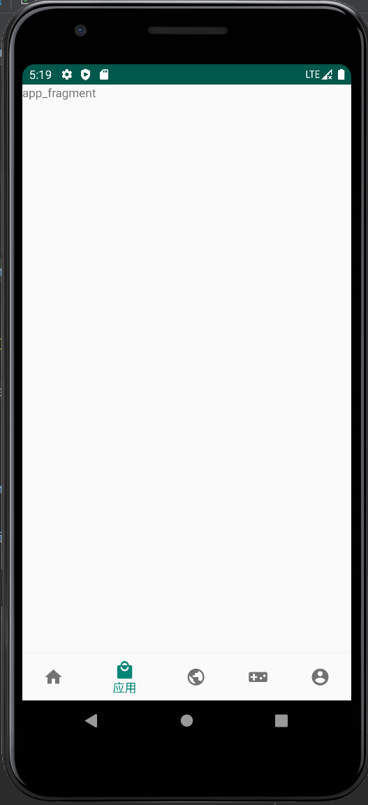
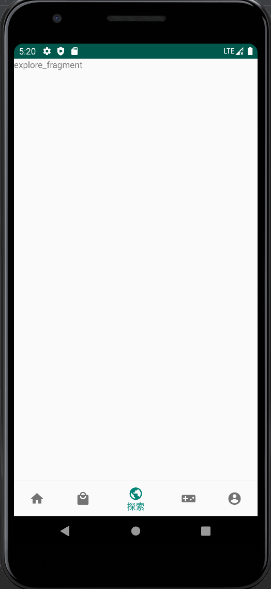
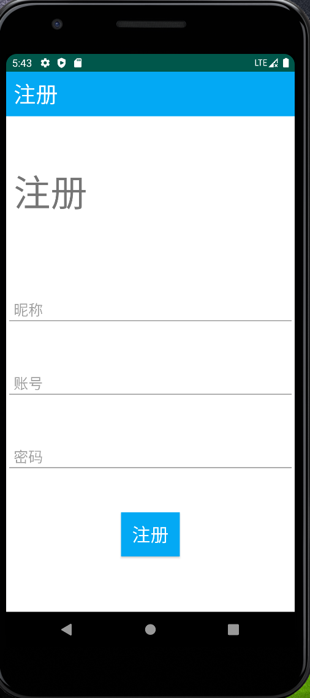
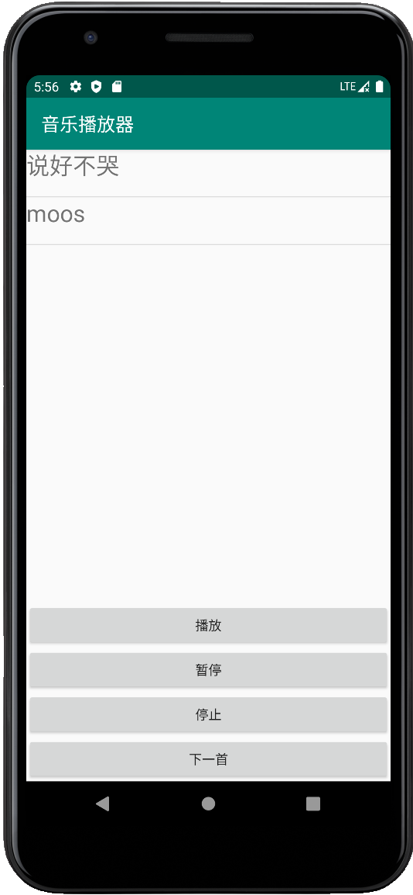
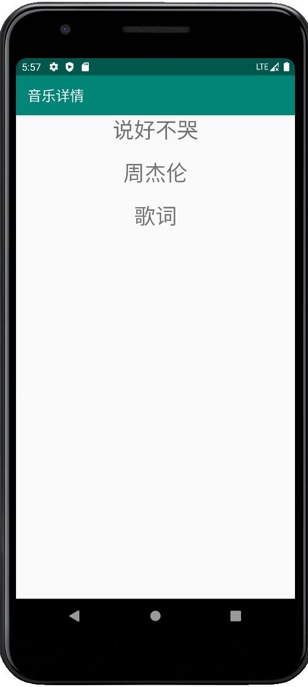

# 移动应用软件开发技术 实验4
## 一、 实验目的

1. 熟悉Android Studio开发工具使用

2. 掌握Fragment的使用

3. 理解Activity和Service组件的作用。

4. 能根据常用控件设计的APP应用程序

## 二、 实验任务

1. fragment应用

2. Activity应用

3. Service应用

## 三、 实验环境

PC机、Android Studio

## 四、 实验内容

### （一）、常用控件应用 

1. 编写程序，实现如下功能：

实现APP底部导航栏5个选项切换，显示当前对应的页面：

（1） 底部包含五个按钮，分别切换到不同的fragment。

（2） 首页Fragment实现“推荐”和“应用榜”两个子页面，其内容用图片代替。要求使用TabLayout+ViewPager2实现。

（3） 其余fragment可采用imageview实现简单实现

（4） 点击“我的”Fragment中的图片，实现页面的跳转到某个Activity。

***提示：***

a.推荐使用BottomNavigationView+FragmentContainerView；

b.实现类似效果即可，“我的”可不显示数字55

2. 运行结果

 
 
 
 

###（二）、Activity跳转

1. 编写程序，实现如下功能：

设计用户注册及登录App：

（1） 首页有登录和注册两个按钮,有两个文本框显示昵称和账号，初始化为“未登录”和“用户ID”。

（2） 点击注册，跳转到注册页面，包括昵称、账号、密码，点击注册按钮后，关闭注册页面，并返回昵称和账号到首页显示；

（3） 点击登录，跳转到登录页面，包括账号、密码，点击登录按钮后，进行校验，成功后关闭登录页面，并返回昵称和账号到首页显示；

 

***提示：***

 a.下面图片仅供参考，实现相关功能即可；

2. 运行结果
 
  
  
  

### （三）、Service应用

1. 编写程序，实现如下功能：

设计音乐播放列表：

（1） 设计一个歌单列表，使用ListView实现。

（2） 为ListView添加setOnItemClickListener事件，播放当前音乐，使用Service实现；

（3） 为ListView添加setOnItemLongClickListener事件，跳转到详情页面：显示歌名、歌手、歌词

（4） 增加播放、暂停、停止按钮，实现音乐播放。

***提示：*** 

a.音乐播放用MediaPlayer； 

b.音乐文件存放在raw文件夹下；
2. 运行结果
 
  